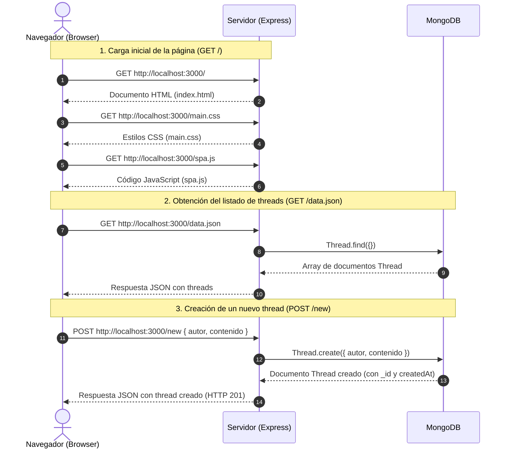

# Laboratorio 2: listado de threads

## Preparación

1. Ejecute `npm install`.
2. Inicie MongoDB localmente en su computador.
3. Ejecute `npm run dev` y abra `http://localhost:3000`.

El servidor usa la base de datos local `cc5003-lab-2` en `mongodb://127.0.0.1:27017`. No requiere configurar archivos ni variables de entorno.

Los bloques marcados como `P1` a `P5` corresponden a las preguntas del enunciado. No elimine los bloques de manejo de errores ni de conexión a la base de datos.

## MongoDB y mongoose

MongoDB almacena documentos: objetos similares a JSON. Cada documento tiene automáticamente un identificador `_id`. La aplicación usa la base de datos local `cc5003-lab-2`; no se comparte con otros grupos, por lo que el modelo se llama simplemente `Thread`.

La conexión ya está implementada al final de `src/app.ts`:

```ts
mongoose.connect("mongodb://127.0.0.1:27017/cc5003-lab-2");
```

No es necesario modificar esa conexión. Cuando la aplicación se inicie por primera vez, MongoDB creará la base de datos y la colección de threads cuando se guarde el primer documento.

### P1: esquema y modelo

Un esquema describe qué campos puede tener cada documento y cómo se validan. El modelo permite consultar y crear documentos de ese esquema. Complete `src/Thread.ts` siguiendo esta estructura:

```ts
const threadSchema = new mongoose.Schema<IThread>(
  {
    author: { type: String, required: true },
    content: { type: String, required: true },
  },
  { timestamps: true },
);

export const Thread = mongoose.model<IThread>("Thread", threadSchema);
```

`required: true` impide guardar un thread sin ese campo. La opción `timestamps: true` agrega automáticamente `createdAt` y `updatedAt`; por eso el navegador no debe enviar una fecha al crear un thread.

### P2: leer threads

Para obtener todos los documentos del modelo, use `find` dentro de la ruta `GET /data.json`:

```ts
const threads = await Thread.find({});
return res.json(threads);
```

`await` espera la respuesta de MongoDB antes de enviar el JSON al navegador. El bloque `try/catch` que ya viene en la ruta entrega los errores al manejador general del servidor.

### P4: crear threads

El middleware `express.json()` ya transforma el cuerpo JSON de la request en `req.body`. Para crear y guardar un documento, obtenga sus datos y use `Thread.create`:

```ts
const { author, content } = req.body;
const thread = await Thread.create({ author, content });
return res.status(201).json(thread);
```

`Thread.create` valida el esquema, guarda el documento en MongoDB y retorna el thread creado, incluyendo `_id` y `createdAt`.

## Diagrama secuencial

Below is the sequence diagram for P6 showing interactions between Browser (Navegador), Server (Servidor Express), and MongoDB:



